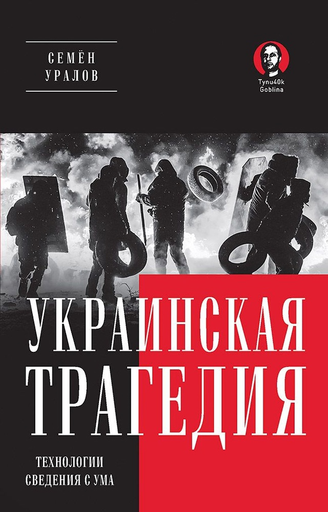
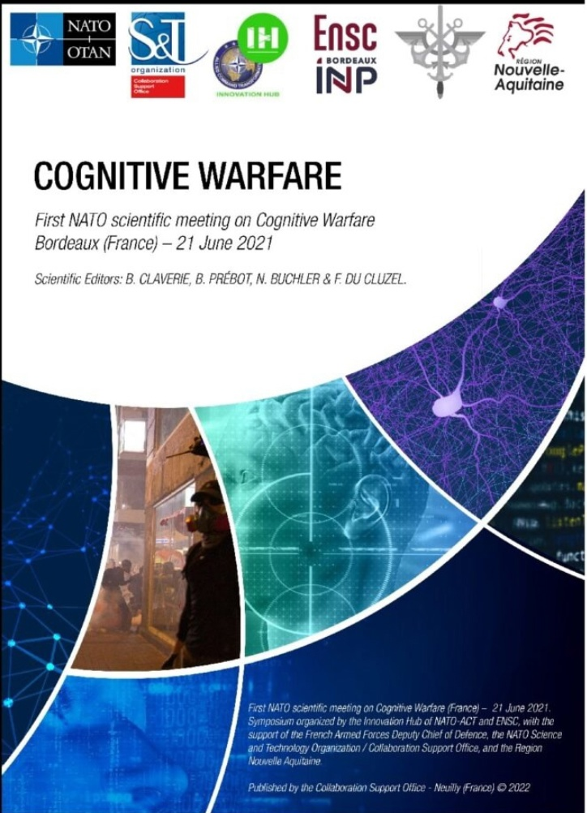
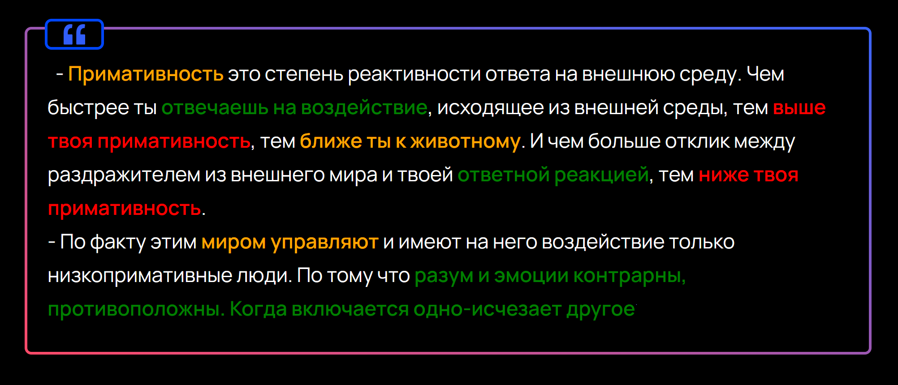
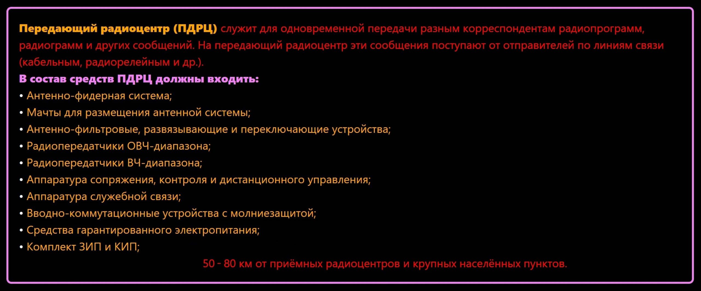
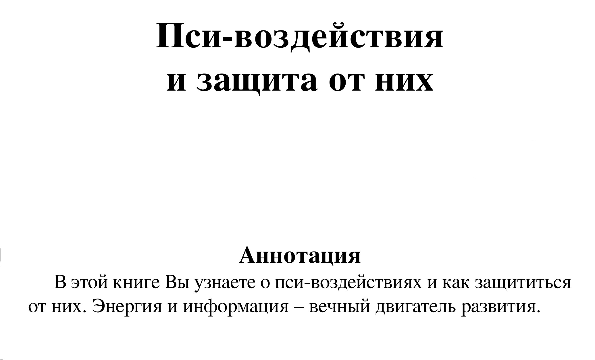

-  Психотронное оружие бездейственно, без Пси - оператора. 
- Пси – оператор, это агрессивно настроенный, сводящий с ума чужой поток сознания, навязываемый образ или «голос в голове» жертвы. Он может подавлять волю, терроризировать, давать определенные приказы. Может быть, как человеком, сидящим за специальной аппаратурой, так и группой людей, или специально созданной компьютерной программой. 

- Единственной целью этой технологии является управление и подчинение человека или его преследование. 

- Другими словами, пси – оператор, это технология или человек, управляющий психотронным оружием на расстоянии или создает его в виде специально созданной компьютерной программы. 

- Изучив вышеперечисленные определения, можно переходить к самому понятию метода, психотронный террор. 

- Психотронный террор - умышленные действия по предварительному сговору группой лиц, направленные на создание ситуации, опасной для жизни человека, его прямому уничтожению или искусственному вызову различных заболеваний, а также нарушение его психики. Причинение материального ущерба в результате повреждения жилища и имущества, подрыва авторитета личности для лишения источника существования, совершенные путем использования оружия и иных предметов излучающего типа в совокупности с другими методами для достижения общей цели. 
Рассмотрев первый метод, переходим к ИПВ, данный метод более распространен в повседневной жизни человека, так же он более заметен в сравнении с психотронным террором. 

- ИПВ (Информационно Психологическая Операции) - это комплекс специальных психологических операций и мероприятий, проводимых с помощью информации, пропаганды и агитации, подготовленной соответствующим образом и доводимой до объекта (групп объектов) воздействия с помощью различных форм психологического воздействия (печатными средствами, радио и телевидение, через непосредственное общение, через информационные компьютерные сети). 

- Пропаганда (лат. propaganda - подлежащее распространению) – распространение каких-либо идей с целью привлечения сторонников. 

- Агитация (лат. agitatio - приведение в движение) - устная, печатная и наглядная политическая деятельность, воздействующая на сознание и настроение людей с целью побудить их к политическим или другим действиям. 

- Исследуя материал по данной теме, можно сделать краткое определение ИПВ, ИПВ - это воздействие словом, информацией. 

- Изучив данный параграф можно понять следующее: 
- Не секрет, что рассмотренные в работе методы взаимодействий существуют в наше время и с каждым годом развиваются все шире и шире. Как оказалось самое слабое место человека, это его психика (разум). Данные методы могут с легкостью изменить или разрушить разум человека. Каждый метод происходит по своему, ПТ – более технический метод, так же он скрытен. ИПВ происходит путем донесения и внушения человеку определенной информации, данный метод менее скрыт, так как его можно наблюдать, включив телевизор. 

- Нормативно - правовое регулирование, противодействующее негативному воздействию на человека. 

- Вопросы воздействия на сознание и подсознание человека издавна волновали людей во многих странах мира. Новые информационные технологии, средства массовой коммуникации многократно усилили возможности такого воздействия на психику человека, на большие группы людей и в целом население страны. Данные методы, которые рассматриваются в работе, опасны. Каждое государство старается снизить уровень психологического воздействия на население. В связи с этим разрабатывалось и применялось определенное нормативно - правовое регулирование. 

## 
Когнитивные войны — это концепция, связанная с использованием психологических и когнитивных методов воздействия на общественное мнение, поведение и восприятие людей с целью достижения политических, военных или экономических целей. Эти войны сосредоточены на воздействии на человеческий разум, используя информацию и психологические механизмы. Вот некоторые из ключевых техник когнитивных войн: 
Основные аспекты чёрной психологии ->
{ Техники манипуляции }

- Использование страха, вины и других эмоций для контроля над поведением.
- Создание зависимостей: эмоциональная или финансовая манипуляция.
- Лжесвидетельства и дезинформация: использование лжи для достижения целей.

### 1 . **Информационные операции**
Целенаправленное распространение информации (в том числе ложной или искажённой) с целью манипулирования общественным мнением и восприятием. Основные методы:
- **Дезинформация** — сознательное распространение ложной или вводящей в заблуждение информации для формирования неправильных выводов или подрыв доверия.
- **Пропаганда** — систематическое распространение односторонней информации с целью укрепления определённых политических или идеологических убеждений.
- **Фальшивые новости (Fake News)** — создание и распространение лживых новостей для введения людей в заблуждение или создания паники.
- **Манипуляция социальными медиа** — создание фейковых аккаунтов, ботов, использование троллинга для массового распространения ложной информации или подавления альтернативных мнений.

### 2 . **Психологические операции (PSYOPs)**
Целенаправленное воздействие на эмоции, восприятие и поведение людей для достижения желаемых результатов. Эти операции могут включать:
- **Подрыв доверия** — создание недоверия к официальным источникам информации, государственным институтам и медиа через распространение теорий заговора или дезинформации.
- **Создание страха и паники** — использование ложной информации для создания чувства страха, неуверенности и угрозы, чтобы изменить поведение людей.
- **Умышленное разжигание конфликтов** — использование информации для разжигания межэтнических, религиозных и социальных конфликтов с целью дестабилизации общества.

### 3 . **Контроль над нарративом (Narrative Control)**
Способность управлять доминирующим нарративом и фреймингом (рамками) обсуждаемых тем в обществе. Техники:
- **Переключение повестки** — фокусирование внимания общества на определённых событиях или проблемах, чтобы отвлечь внимание от более важных вопросов.
- **Создание альтернативных реальностей** — формирование параллельных нарративов, где события интерпретируются с противоположной точки зрения.
- **Использование культурных или идеологических символов** — мобилизация эмоций через использование символов, мифов или исторических примеров.

### 4 . **Таргетированное воздействие на группы (Micro-targeting)**
Использование данных о поведении и психологии конкретных целевых групп (например, политических, социальных, этнических) для разработки контента, который будет влиять на их восприятие. Методы:
- **Анализ больших данных** — использование данных из соцсетей, поисковых запросов и других источников для понимания психологии целевых аудиторий.
- **Персонализированная реклама** — таргетирование пользователей на основе их интересов, эмоциональных состояний или политических предпочтений для манипуляции их взглядами и поведением.

### 5 . **Кибернетическое манипулирование и хакерство**
Использование технологий для влияния на поведение через кибератаки или взлом информационных систем.
- **Взлом медиа и платформ** — взлом сайтов и социальных сетей для размещения ложной информации.
- **Фейковые профили и учётные записи** — использование бот-сетей и фальшивых аккаунтов для создания иллюзии массовой поддержки или нападения.

### 6 . **Эмоциональное программирование (Emotional Priming)**
Создание эмоциональных реакций, влияющих на когнитивные процессы и восприятие информации. Эта техника используется для:
- **Закрепления негативных или позитивных ассоциаций** — создание ассоциаций между эмоциональными состояниями и определёнными объектами, людьми или идеями (например, привязка страха к определённой политической партии).
- **Использование эмоциональных триггеров** — повторяющееся упоминание определённых событий или слов для усиления эмоциональных реакций.

### 7 . **Манипуляция через когнитивные искажения**
Использование известных когнитивных искажений для влияния на мышление:
- **Эффект первичности и новизны** — акцент на первых или последних аргументах для закрепления нужной информации в памяти.
- **Искажение подтверждения** — подача информации, которая подтверждает уже существующие убеждения целевой аудитории, для закрепления её уверенности в определённой точке зрения.

### 8 . **Социальная инженерия**
Манипуляция людьми через психологические методы для получения доступа к информации или изменению их поведения. Основные методы:
- **Фишинг и социальные атаки** — получение личной информации через обман и манипуляцию.
- **Создание доверия** — использование фальшивой идентичности для проникновения в целевые группы и влияния на их решения.

### 9 . **Культура отмены и социальное давление**
Создание ситуаций, в которых определённые люди или группы подвергаются социальному давлению или критике, что ведёт к самозацензурированию и изменению поведения под влиянием страха изоляции.

Когнитивные войны часто пересекаются с информационными войнами и психологическими операциями и предполагают комплексный подход к манипуляции сознанием с целью изменения восприятия и поведения как отдельных людей, так и целых обществ.

<a href="https://vk.com/s/v1/doc/ib9NLNF0zlYqpsy6hiKoFhRq35wtZONprwvylM2mrQ1MmBDfYek"> 
  >_ Украинская Трагедия: технологии сведения с ума
 </a>

 

<a href="https://vk.com/s/v1/doc/aMwr8uKVTrnALgfOhLVBfQWYQJyvOfkT3PmCnE0XfDq-95Ehb7M"> 
  >_ Когнитивная война:
Будущее когнитивного доминирования 
 </a>

 

 

## <a href="https://www.youtube.com/watch?v=cwH81E5_Rtg&list=PLEDX369m70iiVYjVtszu_0hRkZhkMX9GO"> 
  >_ КАРТЫ СМЫСЛА 
 </a>

<!-- ## <a href="https://drive.google.com/drive/folders/19jMAi35cRh827reofNy4cn32yjklQl90"> 
  >_ как привести себя в ресурсное состояние 
 </a> -->
<iframe style="width:100%;height:35vh;border:0;border-radius:10px;" src="https://www.youtube.com/embed/zDu9-qhbejA"></iframe>

<iframe style="width:100%;height:35vh;border:0;border-radius:10px;" src="https://brainchop.org/"></iframe>
<iframe id="fr" src="https://tools.latticeautomation.com/seqviz/" style="width: 100%;height: 35vh;border: 0;"></iframe>

<h2> >_ [ Подсознание ] - это в первую очередь :    {  Рептильный мозг и Лимбическая Система  }   ЭМОЦИИ, ОБРАЗЫ, ВКУС, ЗВУК, ЗАПАХИ и ОЩУЩЕНИЯ </h2>

    

<!---->

<iframe style="width:100%;height:35vh;border:0;border-radius: 10px;" src="https://www.youtube.com/embed/lPUGB69cu6Q"></iframe>

# 
 >_  Культурный Код  и  { Фенотипирование Человека } 

<iframe style="width:100%;height:35vh;border:0;border-radius: 10px;" src="https://www.youtube.com/embed/NaAQzaV3VtQ"></iframe>

<!--<a href="https://www.youtube.com/@b_chp/videos">-->

## 
&nbsp;&nbsp;&nbsp;- Cистема предрасположенностей, которая сначала формируется у индивида под влияем социальной среды, в которой он живет, а затем регулирует поведение индивида без его сознательного участия. 

  
## <a href="https://www.youtube.com/@teloschannel">СОЦИОЛОГИЯ</a> и ЭТОЛОГИЯ Человека изучает поведение человека как результат взаимодействия биологических и социокультурных факторов. Она базируется на теоретических представлениях и методах, разработанных в этологии животных, и одновременно находится в тесной связи с гуманитарными дисциплинами.
## СОЦИОБИОЛО́ГИЯ (от лат. societas – об­ще­ст­во, био... и ...ло­гия), на­прав­ле­ние в био­ло­гии, свя­зан­ное с изу­че­ни­ем всех форм со­ци­аль­но­го по­ве­де­ния жи­вых су­ществ, вклю­чая че­ло­ве­ка. С. опи­ра­ет­ся на дан­ные по­пу­ля­ци­он­ной ге­не­ти­ки, это­ло­гии, эко­ло­гии и эво­люц. тео­рии. С. че­ло­ве­ка ис­поль­зу­ет так­же дан­ные со­цио­ло­гии, со­ци­аль­ной пси­хо­ло­гии, ан­тро­по­ло­гии и эт­но­гра­фии. Цен­траль­ным для С. яв­ля­ет­ся по­ло­же­ние о ге­не­тич. де­тер­ми­ни­ро­ван­но­сти разл. ас­пек­тов по­ве­де­ния жи­вот­ных, вклю­чая фе­но­ме­ны со­ци­аль­но­го по­ве­де­ния.

<iframe style="width:100%;height:35vh;border:0;border-radius: 10px;" src="https://www.youtube.com/embed/DBWSRTcTC5w?si=4UXVLUsSwWelobcl"></iframe>

&nbsp;&nbsp;&nbsp;- Этология человека изучает поведение человека как результат взаимодействия биологических и социокультурных факторов на основе представлений и методов общей этологии, изучающей поведение животных. Поведение человека и животных имеет немало общего, но этология человека не переносит на человеческое поведение особенности животных, а рассматривает его как уникальное существо. Этология человека – состоявшаяся научная дисциплина, которая исследует в своем ключе все поведение человека: поведение детей и родителей, агрессивное поведение и дружественное, этологию города и этологию искусства, общение без слов и со словами  и многое другое. 

<iframe style="width:100%;height:35vh;border:0;border-radius: 10px;" src="https://www.youtube.com/embed/HZFNAuSyU6o?si=qlnA3T1_-nqXl2cG"></iframe>

# 
 >_ <a style="color:black;" href="dark.html"> Синтетическая Телепатия </a> и <a style="color:black;" href="dark.html"> { Чёрная Психология }</a> 

## <a target="blank" href="https://www.youtube.com/watch?v=BXNvKTtx1o4"> 
  Современные методы слежки и контроля населения  
 </a>

## 
 - Синтетическая телепатия это Радио-Мозг-Компьютер-Интерфейс-Распознавание-Намерения-Кость-Проводимость (РМКИ-РНКП) 

<iframe style="width:100%;height:35vh;border:0;border-radius: 10px;" src="https://www.youtube.com/embed/RRbppibf_XE?si=RSWlBuFbG7afH0UD"></iframe>

## 
 - Synthetic Telepathy this is Radio-Brain-Computer-Interface-Recognition-Intents-Bone-Conduction (RBCI-RIBC) 

## <a target="blank" href="https://youtu.be/COWTBEl1rRc">
 Directed Energy Weapons Used On Citizens
</a>

In the past three decades, directed energy weapons have made their way from their military industrial origins into the <a href="https://www.youtube.com/watch?v=8P9Q3Ow4qjY">global telecommunication systems (LTE/5G-NR), integrated into beamforming- and steering phased array radar and MIMO transmitters</a>.

 
    

The use of these and previous/battlefield versions of these weapons on civilians has been reported in many <a href="https://genasys.com/">NATO states ("Voice2Skull", "LRAD", "Medusa")</a>, the Russian Federation ("Weapons based on new physical principles"), China ("Neurostrike"), Iraq ("Medusa" & unknown high power DEWs) and a large number of other countries. The number of people reporting severe symptoms mimicking those found in <a href="https://www.forbes.ru/society/447285-wp-cru-prigrozilo-rossii-posledstviami-za-gavanskij-sindrom-u-diplomatov-ssa">Havana Syndrome</a> accompanied by synthetic schizophrenia and synthetic telepathy (the use of the microwave auditory effect and remote neural monitoring simultaneously) is increasing dramatically on a global scale.

<iframe style="width:100%;height:35vh;border:0;border-radius: 10px;" src="https://www.youtube.com/embed/k6c2S-BCm8c?si=FlVQony78hD487EQ"></iframe>

 <h3 style="background: orange;color: black;font-weight: 900;padding-bottom: 3px;">  Invisible Concentration-Camps  </h3> 

&nbsp;&nbsp;&nbsp;We are in the first quarter of the 21st century and already there exist invisible concentration camps where many suffer in silence - unable to even form basic concepts of the weaponry being used against them, if they are even aware that they are targeted with high tech weaponry. These weapons are highly advanced, their development highly covert and they are very easy to conceal. It is therefor extremely hard to gather enough data, testimonies and proofs to show they not only exists but that they are used on civilians. These modern microwave-based weapon systems are used every day. By global elites, militaries and intelligence agencies - on foreign and domestic populations for the purpose of what appears to be a secret and highly sadistic depopulation scheme so covertly executed that the victims often have nobody to turn to who will believe their story.
  
&nbsp;&nbsp;&nbsp;Every day millions find themselves under attack, having muscle spasms, the feeling of hot needles prodded into their limbs, having sensations of either being too hot or too cold, and many other types of paresthesia. In the worst cases they experience extreme psychological trauma, cognitive damage and the horrifying unraveling of synthetic schizophrenia in their lives.

 
 <h3 style="background: orange;color: black;font-weight: 900;padding-bottom: 3px;">  Psychological Trauma  </h3> 

&nbsp;&nbsp;&nbsp;The psychological trauma is caused by the extreme interrogation and propaganda techniques used, synthetic schizophrenia and the combination of physical and mental assaults. After days, weeks, months or even years of hearing voices through constant "Voice2Skull", combined with a diverse array of other mind-bending and body-contorting effects, day and night, a person wears out and resilience breaks down. Good nights sleep become far and few between and targeted individuals resort to medication that sometimes causes more harm than good. 

 
 <h3 style="background: orange;color: black;font-weight: 900;padding-bottom: 3px;">  Cognitive Damage  </h3> 

&nbsp;&nbsp;&nbsp;The cognitive damage is apparent in many cases, as targeted individuals report having the feeling that part of their brain has been turned off - not being able to concentrate, read, write, work or even communicate. Or they report feeling extremely lethargic for no reason. It could be that they report their breathing is artificially impeded causing lightheadedness and a host of other side-effects. Some report bouts of racing heart or the opposite: the sensation of near stopping of the pulse.  None of this is a recipe for good cognitive health - nor physical well-being. 

 
 <h3 style="background: orange;color: black;font-weight: 900;padding-bottom: 3px;">  Knock-Out  </h3> 

&nbsp;&nbsp;&nbsp;In some cases the weapons are apparently set to a "stun" mode - there are many reports of people being knocked out for a period of time, experiencing something akin to an electric shock. Other times different signals or modulations are used and people report becoming extremely agitated and anxious - or extremely paranoid, so much so that fleeing one's house seems like a good option.

 
 <h3 style="background: orange;color: black;font-weight: 900;padding-bottom: 3px;">  Synthetic Schizophrenia  </h3> 

&nbsp;&nbsp;&nbsp;And then there's the synthetic schizophrenia. It is undoubtedly the most vile form of targeting. It presents when advanced evolutions of microwave auditory effect technologies are paired with advanced generative artificial intelligence and high-fidelity digital signal processing to cause people to hear ultra-realistic voices in their head, strange noises around them and even the experience of having conversations heard around them altered on-the-fly.
 
&nbsp;&nbsp;&nbsp;It's hard to put into words how those who have designed and developed these systems can face themselves in a mirror. Synthetic schizophrenia is the weapon wielders' of the best line of defense. Because unfortunately, with the low societal awareness and the outwardly appearing overlap of symptoms of targeting with schizophrenia, targeted individuals have virtually no chance of being taken seriously. The targeted individual's plight nor the technologies used to target them live in the minds of the current psychiatric establishments or justice systems. Most of society is unaware and unprepared for the paradigm shift that targeted individuals were already forced to make - to their grave detriment. 
 
&nbsp;&nbsp;&nbsp;All this perceived-audio-tweaking is done in a highly sadistic and evil manner, often containing heavy propaganda designed to remove persons from reality. It is used to undermine the target's psychology by turning any and all insecurities they have about themselves, those around them or their situations against them.  A prime goal of this system is to grab and hold a person's attention and to cause dissociation and de-realization, and physical and mental disability. But the only "help" offered from society may easily escalate into a one-way trip to the psychiatry ward.

 
 <h3 style="background: orange;color: black;font-weight: 900;padding-bottom: 3px;">  Targeting Phases  </h3> 

&nbsp;&nbsp;&nbsp;Usually targeting starts with trying to convince the target that their neighbors, colleagues or landlords are out to get them, in the hope that the targeted individual will lash out and go to prison, the psych ward and lose their job and house. It is not hard to drive a person over the edge in that way, as witnessed by the many shootings where something about mind-control, electromagnetic weapons or hearing voices was connected to the shooter's psychology.
 
&nbsp;&nbsp;&nbsp;When that first phase fails, the program switches to pulling targeted individuals into fantastical fringe conspiracy theories, concerning often used tropes from Hollywood and the mainstream media (UFOs, demons, time travel, being "chosen ones", etc). The synthetic telepathy often mimics the "psychic driving" technique known from the surviving MKULTRA documents. 
  
&nbsp;&nbsp;&nbsp;Lastly when the target is still not down and out, the physical attacks are ramped up and the psychological attacks become more opportunistic - waiting for a moment when the target is open to suggestion, fatigued, had too much to drink or other compromising states. And then it lashes out - hard. It becomes a war of attrition that the target usually loses.

     
  

# 
Depending on the level of competence of the operator, people may not notice him at all all their lives

    

# 
В зависимости от уровня компетентности оператора люди всю жизнь могут вообще его не замечать

• разрушение доверительных отношений с родственниками  
• расстройство памяти  
• внедрение ложных воспоминаний  
• дискредитация человека его поведением  
• изменение сексуальных привычек  
• методы выпытывания информации  
• внушаемость  
• создание у человека чувства зависимости

## 
 ГОСТ Р 43.0.3-2009 

    

## 
Термины и определения

- 3.1 абдукативные решения: Решения, принимаемые оператором по предварительно оцененной (с фиксацией следствий) информации на основе приобретенных ранее знаний.

- 3.2 абстрактное мышление: Мышление, представляющее собой способность оператора образовывать общие понятия, отрываясь в восприятиях от реальности, рефлексировать (быть в состоянии рефлексии).

- 3.3 висцериоз: Внутренняя деятельность мышления оператора, направленная на практическое взаимодействие с внешней средой.

- 3.4 дедуктивные решения: Решения, принимаемые оператором по непосредственно воспринимаемой информации на основе приобретенных ранее знаний.

- 3.5 дисайдиозис: Внутренняя мыслительная деятельность оператора, направленная на принятие решения по необходимому использованию (с возможным преобразованием) информации, хранящейся в памяти или воспринимаемой из внешней среды.

- 3.6 дисайдизированные навыки к деятельности: Навыки оператора к деятельности, характеризующиеся принятием решений.

- 3.7 единая ноон-технология: Ноон-технология, применяемая с использованием необходимых технических устройств, обеспечивающих расширенные возможности ее применения по целевому назначению.

- 3.8 имерсинг: Психоинформационное интегрированное включение ("адаптированное погружение") оператора в необходимую техническую информационную среду.

- 3.9 импрессизация деятельности мозга: Изменение мышления, мыслительной деятельности мозга оператора с применением информационных воздействий на функционально-психическую деятельность мозга для управления его информационно-интеллектуальной деятельностью.

- 3.10 индуктивные решения: Решения, принимаемые оператором по предварительно оцененной (проведенной с преобразованием и экстраполяцией исходной ситуации, с предвидением изменений в ситуации) им информации на основе приобретенных ранее знаний.

- 3.11 интериориз: Мыслительная деятельность оператора, направленная на обеспечение перехода информации, воспринимаемой из внешней среды, в его мышление для применения воспринятой информации во внутренней информационно-интеллектуальной деятельности.

- 3.12 интроекциоз: Мыслительная деятельность оператора, направленная на включение в свое мышление семантической информации, воспринимаемой извне или созданной им самим.

- 3.13 информационная технология: Технология с использованием каких-либо средств воздействия на информационные объекты, направленного на достижение поставленной цели, заключающейся в необходимом изменении информационных объектов, подвергаемых воздействию.

- 3.14 информационно-интеллектуальная технология: Технология с использованием каких-либо средств воздействия на информационные объекты, направленного на достижение поставленной цели, заключающейся в необходимом интеллектуализированном изменении информационных объектов, подвергаемых воздействию.

- 3.15 концептуальная модель: Абстрактная модель, определяющая структуру исследуемого объекта (составные части и связи), свойства составных частей, причинно-следственные связи.

- 3.16 клиаратиозис: Внутренняя (клиаративная) мыслительная деятельность оператора, направленная на понимание используемой им информации с возможным учетом воспринимаемой и хранящейся в памяти информации.

- 3.17 когнитиозис: Конечный этап интроекциоза в мышлении оператора, обеспечивающий проведение рассуждений, умозаключений с формированием (в том числе направленным) в мышлении оператора технических сущностей в виде когнитивных (познавательных) семантических отражений.

- 3.18 коммуникативная информационная деятельность: Информационная деятельность, обеспечивающая жизнедеятельность оператора в окружающей среде, его межличностное общение.

- 3.19 креатиозис: Внутренняя (креативная) деятельность мышления оператора, направленная на творческое преобразование информации, хранящейся в его памяти, с возможным учетом воспринимаемой информации.

- 3.20 моделинг-ноонинг: Знаковое (знакообразуемое) пикториальное, пикториально-аудиальное представление технических сведений с применением грамматики, семантики используемой знаковой системы в виде картинно воспринимаемых сообщений, соответствующих психофизиологии мышления оператора.

- 3.21 моносемантические знаки: Эталонные знаки, по исполнению представленные в виде контекстно обособленного семантического фрагмента сведений.

- 3.22 морфинг информации: Изложение информации в виде, при котором одно фрагментированное изображение переходит ("перетекает") в другое.

- 3.23 направленное регулирование: Направляемая необходимым способом деятельность по поддержанию заданного состояния чего-либо (например, объекта, системы).

- 3.24 направленное управление: Направляемая необходимым способом деятельность по заданному изменению состояния чего-либо (например, объекта, системы).

- 3.25 ноон-моделирование: Представление сведений, содержащихся в информации, с использованием раздельного или совместного объектно-ориентированного (познавательного), интерпретационно-имитационного предметного (прагматического) моделирования в виде картинных с необходимым аудиальным сопровождением образно воспринимаемых знаковых моделей, соответствующих психофизиологии мышления оператора, применяющего эти модели.

- 3.26 натурные тренажеры: Тренажеры, выполненные в виде, имитирующем с определенной степенью соответствия реальные образцы техники.

- 3.27 натурно-информационные тренажеры: Тренажеры, выполненные в виде, имитирующем с определенной степенью соответствия реальные образцы техники с применением информационных представлений необходимых компонентов предметной технической и внешней сред.

- 3.28 ноон-технология: Технология создания информации в виде, соответствующем психофизиологии человека (с использованием результатов исследований, полученных в ноонике), для реализации оптимизированных информационно-обменных процессов в СЧИ при создании, хранении, передаче, применении сообщений.

## 
  ГОСТ Р 43.0.2-2006, статья А.2 (приложение А) 

 
    

- 3.29 пикториально-аудиальное представление технических сведений: Представление сведений в картинном и речезвуковом виде.

- 3.30 полисемантические знаки: Эталонные знаки, по исполнению представленные в виде обособленных контекстно объединенных семантических фрагментов сведений.

- 3.31 прогностические решения: Решения, принимаемые оператором по предварительно оцененной (по правилам статических решающих функций) информации на основе приобретенных ранее знаний.

- 3.32 процедуризированная информация: Информация, представленная в виде, обеспечивающем ее управление по каким-либо параметрам, характеристикам.

- 3.33 пэсифицированная информация: Информация, не воспринимаемая в образном виде, представленная в пикториализированном виде.

- 3.34 регулирование: Деятельность, направленная на поддерживание заданного состояния чего-либо (например, объекта, системы).

- 3.35 рефлексика мышления: Подсознательно-самопроизвольная ответная реакция мышления оператора на действие чувственно воспринимаемого информационного раздражителя какого-либо внутреннего или внешнего происхождения.

- 3.36 рефлексия: Способность оператора наблюдать за самим собой, видеть и изучать себя со стороны.

- 3.37 рефлексосемантика мышления: Подсознательно-самопроизвольное формирование мышлением оператора текущих (временных) семантических информационных образований (отражений).

- 3.38 рефлектизированная информация: Информация, представленная с повышенным уровнем отражательных характеристик.

- 3.39 семантизированные информационно-психические явления: (В деятельности оператора). Информационно-психические явления (базовые, периферийные), возникающие в мышлении оператора под воздействием семантических информационно-обменных процессов, образующихся при восприятии им внешней информационно-предметной среды.

- 3.40 семантика мышления: Сформированные в мышлении оператора константные (постоянные) семантические информационные образования.

- 3.41 семантиозис: Начальный этап висцериоза, обеспечивающий формирование понятий в мышлении оператора.

- 3.42 семиозис: Конечный этап отражения воспринимаемой информации в мышлении оператора, обеспечивающий формирование представлений.

- 3.43 симбиозитивное управление информацией [базами знаний]: Управление (на биоуровне строения человека) информацией [базами знаний] с применением направленно-изменяемого симбиозитированного человекоинформационного активно-интерактивного взаимодействия.

- 3.44 синергетика: (В психике личности). Психоинформационное самоорганизующееся изменение отражения действительности в мышлении оператора, возникающее под воздействием органов чувств, процессов мышления.

- 3.45 синергия: (В психике личности). Психоинформационное взаимодействие (совместное координированное действие) органов чувств, процессов мышления, обеспечивающее в мышлении оператора разностороннее отражение действительности.

- 3.46 симулятор: Техническое устройство, работа которого основана на управлении информацией с целью передачи оператору, пользующемуся этим устройством, знаний, а также выработки у него интеллектуальных, моторных, интеллектуально-моторных навыков и умений.

## 
  ГОСТ Р 43.0.2-2006, статья А.11 (приложение А) 

- 3.47 синестезия: (В психике личности). Психоинформационное ассоциативное взаимодействие, устанавливающее в мышлении субъекта (оператора) межчувственные связи.

- 3.48 социум-значимые знания: Знания, относящиеся к приобретенным социумом.

- 3.49 стимулятор дидактический: Техническое устройство, работа которого основана на информационном взаимодействии с оператором - пользователем этого устройства в целях формирования в его мышлении реконструктивных концептуальных моделей технической среды, в том числе относящихся к поведенческим, для развития способности к отвлеченному мышлению у оператора с возможностью использования этой способности в текущей реальной деятельности, в приобретении навыков абстрагирования, предвидения, в том числе в состоянии рефлексии.

- 3.50 субъектно-значимые знания: Знания, относящиеся к приобретенным соответствующим субъектом (оператором).

- 3.51 творческая деятельность: Мыслительная деятельность оператора, направленная на образование новой информации, обеспечивающей достижение какой-либо цели.

- 3.52 техника: Совокупность технических устройств, предназначенных для использования в деятельности человека, общества.

## 
  ГОСТ Р 43.0.2-2006, статья А.4 (приложение А) 

- 3.53 техносфера: Область распространения техники, определяемая потребностями социума.

- 3.54 технология: Совокупность процессов с использованием каких-либо средств воздействия на объекты, направленных на достижение поставленной цели, заключающейся в необходимом изменении объектов, подвергаемых воздействию.

- 3.55 управление: Деятельность, направленная на заданное изменение состояния чего-либо (например, объекта, системы).

- 3.56 функциональное информационное обеспечение: Информационное обеспечение, непосредственно участвующее в функционировании соответствующего образца техники, выполнении им своего назначения.

- 3.57 цефализация деятельности мозга: Изменение мышления, мыслительной деятельности мозга оператора применением информационных воздействий на физиологическую структурно-организменную деятельность мозга для управления его информационно-интеллектуальной деятельностью.

- 3.58 человек-оператор СЧМ; оператор СЧМ: Человек, осуществляющий трудовую деятельность, основу которой составляет взаимодействие с объектом воздействия, машиной и средой на рабочем месте при использовании информационной модели и органов управления.

## 
  ГОСТ 26387-84, статья 3 

- 3.59 эвристическая информационная деятельность: Информационная деятельность, обеспечивающая творческое мышление оператора, его творческое взаимодействие с окружающей средой.

- 3.60 экстериориз: Мыслительная деятельность оператора, направленная на обеспечение перехода информационного состояния его мышления во внешние практические действия.

- 3.61 эргатическая информационная деятельность: Информационная деятельность, обеспечивающая практическое взаимодействие оператора с окружающей средой.

 
    

## 
  В настоящем стандарте применены следующие сокращения: 

- ГИ - гибридный интеллект;

- ГИЧИВ - гибридно-интеллектуализированное человекоинформационное взаимодействие;

- ЕИ - естественный интеллект;

- ЕИЧИВ - естественно-интеллектуализированное человекоинформационное взаимодействие;

- ЕСЧИ - естественная система "человеко-информация";

- ИЕСЧИ - интегрированная естественная система "человеко-информация";

- ИИ - искусственный интеллект;

- ИИД - информационно-интеллектуальная деятельность;

- ИИЧИВ - искусственно-интеллектуализированное человекоинформационное взаимодействие;

- ИОП - информационно-обменные процессы;

- ИОТОД - информационное обеспечение техники и операторской деятельности;

- ИПВР - информационное пространство виртуальной реальности;

- ИСВР - информационная среда виртуальной реальности;

- ИСМИ - интегрированная система "машина - информация";

- ИСЧИМ - интегрированная система "человек - информация - машина";

- ИСЧИМИ - интегрированная система "человек - информация - машина" исследовательская;

- ИСЧИМИР - интегрированная система "человек - информация - машина" игровая, развлечений;

- ИСЧИМО - интегрированная система "человек - информация - машина" обучающая;

- ИСЧИМУ - интегрированная система "человек - информация - машина" управляющая;

- ИЧИВ - интеллектуализированное человекоинформационное взаимодействие;

- КИИ - компонентный искусственный интеллект;

- МД - мыслительная деятельность;

- ПАИ - пассивно, активно, интерактивно управляемые (сведения, сообщения, информация);

- РПП - рефлектизированная, пэсифицированная, процедуризированная информация;

- СЧИ - система "человек - информация";

- СЧИМ - система "человек - информация - машина";

- ЯзОД - язык операторской деятельности.

# 
 Способность осознавать подверженность когнитивным искажениям может быть полезным «мягким» навыком.

## 
  Контроль над СОЗНАНИЕМ ЧЕЛОВЕКА: механизмы, методы и этические дилеммы  

### &nbsp;&nbsp;&nbsp;СОЗНАНИЕ ЧЕЛОВЕКА – это высшая форма психической деятельности, которая включает в себя самосознание, мышление, восприятие, чувства и волю. Вопросы контроля над сознанием человека вызывают неоднозначную реакцию, так как затрагивают темы свободы воли, личной автономии и морально-этических границ. В этой статье мы рассмотрим механизмы и методы, которые применяются для воздействия на сознание человека, а также обсудим этические аспекты такого воздействия.

### 
Механизмы и методы контроля 

1. Психологические приемы

Психологические методы контроля сознания основаны на знании особенностей человеческой психики и включают в себя различные техники убеждения, манипуляции и внушения.

Примеры таких техник включают:

- Реклама и пропаганда, использующие повторение, эмоциональное воздействие и авторитет для формирования определенных взглядов и поведения.

- Гипноз, при котором с помощью специальных техник достигается измененное состояние сознания, позволяющее внедрять определенные идеи или команды.

- НЛП (нейролингвистическое программирование), методика, направленная на изменение мышления и поведения через работу с языковыми моделями и установками.

2. Фармакологические воздействия

Контроль над сознанием может осуществляться и с помощью различных веществ, влияющих на нейрохимические процессы в мозге:

- Психоактивные препараты, такие как антидепрессанты, стимуляторы или транквилизаторы, изменяют эмоциональное состояние и поведенческие реакции.

- Наркотики и алкоголь, способные вызывать зависимость и значительно менять восприятие реальности.

- Ноотропы и умные наркотики, улучшающие когнитивные функции, такие как память, концентрация и скорость обработки информации.

3. Технологические методы 

Развитие технологий, в частности нейротехнологий, открывает новые возможности для влияния на сознание:

- Нейроинтерфейсы и имплантаты, позволяющие напрямую воздействовать на нейронные сети мозга.

- Виртуальная реальность, создающая искусственное пространство восприятия, которое может искажать или заменять реальный мир.

- Методы биофидбэка, с помощью которых человек может научиться контролировать некоторые физиологические процессы, такие как частота сердцебиения или активность мозга.

Этические дилеммы

Использование методов контроля над сознанием неизбежно сталкивается с этическими вопросами. С одной стороны, такие методы могут быть использованы для лечения психических расстройств, реабилитации после травм или улучшения качества жизни. С другой стороны, существует риск злоупотребления, когда контроль над сознанием может применяться для манипуляции, принуждения или даже для создания условий, при которых человек теряет способность к самостоятельному принятию решений.

## 
 Манипулятор для управления толпой использует 

- Социальные,   
- Религиозные,   
- Культурные,   
- Этнические и гендерные предпочтения и убеждения, служащие основой общей самоидентификации группы. 
 
Необходимым условием манипуляции служит присутствие образа врага, организующего толпу как целое.
Легендарный крик толпы: «Распни Его!» — служит древнейшим свидетельством формирования управляемой толпы на основе религиозных установок и яркого образа врага.
Формирование управляемой толпы посредством серии манипуляций становится ключевым инструментом процесса легитимизации и делегитимизации властных институтов в современном мире.

## 
  Основные факторы подавления личности: 

- Занятия бессмысленной работой, причем заключенные должны понимать, что их действия лишены всякого смысла. Например, перенести камень с одного места на другое. Или делать всю работу руками, когда рядом лежит необходимый инструмент; 
- Противоречия в системе правил, когда выполняя одно, обязательно нарушаешь другое. Например, бегать запрещено, но если ты не успеваешь дойти пешком, тебя ждет наказание. Надзиратели часто закрывали глаза на такие нарушения, но создавалась атмосфера постоянного страха; 
- Коллективная ответственность, которая превращала всех узников в надзирателей друг за другом, тем самым склоняя каждого на сторону администрации концлагеря; 
- Непредсказуемая обстановка, когда невозможно что-либо планировать, заставляет действовать строго по инструкции, исключая любую инициативу. Люди начинают верить, что от них ничего не зависит. Полное отсутствие контроля над собственной жизнью разрушает личность; 
- Поощрение безразличия, когда хвалят за то, что человек отворачивается или молча проходит мимо несправедливости, делая вид, что ничего не видит и не слышит; 
- Слом последних морально-нравственных принципов, так называемой последней черты.
     

## <a href="https://opentextnn.ru/old/man/index.html@id=4019"> 
 Беттельгейм Бруно. Просвещенное сердце (Ссылка) 
 </a>

 &nbsp;&nbsp;&nbsp; Управление перспективных исследовательских проектов Министерства обороны США (Defense Advanced Research Projects Agency, DARPA) разместило заявку на технологии защиты военных от когнитивных атак, проводимых через очки смешанной реальности. Согласно запросу ведомства, пользователи очков, способных визуализировать контекстуальную информацию, уязвимы для тактических информационных угроз, таких как подмена данных, ложные сигналы тревоги, ухудшение физического состояния через увеличение задержек между движением и реакцией оборудования, кража данных о бойцах с датчиков устройств и ложные объекты в поле зрения.

## <a href="https://www.darpa.mil/program/intrinsic-cognitive-security"> 
 Программа Внутренней когнитивной безопасности DARPA   (Intrinsic Cognitive Security, ICS) 
 </a>

## 
  Патенты США на технологии бесшумной связи включают: 

- Патент США  6587729 
«Устройство для звуковой передачи речи с использованием радиочастотного слухового эффекта»,  
- Патент США  5159703  
«Система бесшумной подсознательной презентации»,  
- Патент США  6011991  
«Коммуникационная система и способ, включающий анализ мозговых волн и/или использование мозговой активности»,  
- Патент США  3951134  
«Устройство и способ дистанционного мониторинга и изменения мозговых волн».  

&nbsp;&nbsp;&nbsp;Бесшумный речевой интерфейс — это устройство, которое позволяет осуществлять речевое общение без использования звука, издаваемого людьми при озвучивании звуков своей речи. Таким образом, это своего рода электронное чтение по губам . Он работает за счет того, что компьютер идентифицирует фонемы , которые человек произносит, из неслуховых источников информации об их речевых движениях. Затем они используются для воссоздания речи с помощью синтеза речи.

&nbsp;&nbsp;&nbsp;Системы бесшумного речевого интерфейса были созданы с использованием ультразвука и оптической камеры, вводящих данные о движениях языка и губ. Электромагнитные устройства — еще один метод отслеживания движений языка и губ. Еще одним методом является обнаружение речевых движений с помощью электромиографии мышц речевого артикулятора и гортани. Другим источником информации являются резонансные сигналы голосового тракта, которые передаются через КОСТНУЮ ПРОВОДИМОСТЬ и называются неслышимыми шумами. Они также были созданы как интерфейс мозг-компьютер с использованием мозговой активности в моторной коре, полученной с помощью внутрикортикальных микроэлектродов.

 - Фенотипирование Человека: Социальное Фенотипирование Окружающей Средой, Религиозное, Культурное.
 - Прививание желаемых характеристик другим людям может быть сложным и длительным процессом, который требует терпения, понимания и умения взаимодействовать с индивидуальностями.

### Убеждение, установление авторитета, создание эмпатии или манипуляция статусом, адаптировать свое поведение и коммуникативные стратегии, чтобы вызвать желаемые реакции.
### Использование техник манипуляции поведением, такие как психологические игры, манипуляция вниманием, создание давления или создание конфликтов.

## 
  Методы педагогического исследования  

 &nbsp;&nbsp;&nbsp; – Это способы изучения опыта педагогической деятельности, а также педагогических фактов и явлений, установления между ними закономерных связей и отношений с целью дальнейшей научной разработки теории воспитания и совершенствования его практики.
# 
 Эти методы можно объединить в следующие группы:  

##  - Эмпирические методы 
 &nbsp;&nbsp;&nbsp; – Беседа, наблюдение, изучение документации и результатов деятельности, педагогический эксперимент (констатирующий, формирующий, контрольный), естественный эксперимент, социологические методы (социометрия, анкетирование и т.д.);
##  - Теоретические методы 
###  &nbsp;&nbsp;&nbsp;  - Моделирование педагогических ситуаций и процессов, теоретический анализ педагогических фактов и явлений;  

 &nbsp;&nbsp;&nbsp; Методы количественной и качественной обработки педагогической информации – методы математической статистики, шкалирование, ранжирование и т.д.
##  - Методы воспитания: 
 &nbsp;&nbsp;&nbsp; Методы формирования сознания личности – «убеждение» : рассказ, объяснение, разъяснение, лекция, этическая беседа, увещевание, внушение, инструктаж, диспут, доклад, пример;  

 &nbsp;&nbsp;&nbsp; Методы организации деятельности и формирования опыта поведения – «упражнение» : упражнение, приучение, педагогическое требование, общественное мнение, поручение, воспитывающие ситуации;  

 &nbsp;&nbsp;&nbsp; Методы стимулирования поведения и деятельности – «мотивация» : соревнование, поощрение, наказание.
##  - Методы обучения: 
### - По доминирующим средствам:    словесные, наглядные, практические; 
### - По дидактическим задачам:    методы приобретения новых знаний, методы формирования умений и навыков, методы проверки и оценки знаний, умений и навыков; 
### - По характеру учебно-познавательной деятельности:    объяснительно-иллюстративный, репродуктивный, метод проблемного изложения, частично-поисковый, исследовательский. 
---

###  &nbsp;&nbsp;&nbsp; Образец поведения: Cамостоятельно демонстрировать требуемые характеристики, будучи примером для окружающих. Люди имеют тенденцию следовать за образцами, поэтому увидев желаемые качества у героев, они могут постепенно начать принимать их. 
 &nbsp;&nbsp;&nbsp; Поддержка и поощрение: Поддерживать и поощрять других, когда они проявляют желаемые характеристики. Позитивное подкрепление может стимулировать людей к развитию и усовершенствованию своих навыков и качеств. 
 &nbsp;&nbsp;&nbsp; Обучение и тренировка: Проводить обучающие сессии, тренинги или мастер-классы, чтобы помочь другим освоить необходимые навыки и навыки. Практика и повторение играют важную роль в формировании новых характеристик. 
 &nbsp;&nbsp;&nbsp; Эмоциональная поддержка: Устанавливать эмоциональную связь с другими людьми, поддерживая их в трудные моменты, инспирируя и мотивируя. Чувство поддержки и понимания может помочь людям развить желаемые качества. 
 &nbsp;&nbsp;&nbsp; Установление целей: Помогать другим установить четкие и достижимые цели для развития необходимых характеристик. 
Четкое направление и план действий могут помочь людям ориентироваться и двигаться вперед.

#  &nbsp;&nbsp;&nbsp; Анализ данных: данные из социальных сетей, умных устройств и биометрической информации для составления психологического портрета клиента.

#  &nbsp;&nbsp;&nbsp; Психологическое, Ментальное Моделирование: На основе собранных данных, создание индивидуализированных психологических программ, включающие психологические тренинги, медитации и техники саморегуляции.
#  &nbsp;&nbsp;&nbsp; Социальная инженерия: Через взаимодействие в реальной жизни и виртуальном пространстве, создание условий для формирования желаемых характеристик у клиентов.

<iframe style="width:100%;height:35vh;border:0;" src="https://www.youtube.com/embed/7TW3IDR-vIA?si=mdUe32xfMg9sd6Vy"></iframe>   

 &nbsp;&nbsp;&nbsp; Овчинский в ходе обсуждения в студии сообщил, что террористы не действовали самостоятельно, ими осуществлялось «внешнее управление» дистанционно, а результаты первых экспертиз показали, что нападавшие были под воздействием сильного психотропного вещества, которое еще не определено. По его словам, это вещество парализует волю, позволяет управлять человеком и отключает эмоции.
«Этим ублюдкам отключили сознание. Там, скорее всего, в комплексе действовали психотропные вещества, нейропсихологическое это самое… программирование! И, возможно, — это покажет экспертиза, — и чипы вставлены! Потому что сейчас нейробиология позволяет управлять человеком», — заявил Овчинский.

<iframe style="width:100%;height:35vh;border:0;" src="https://www.youtube.com/embed/WuUfMxJRdW8?si=WuUfMxJRdW8"></iframe>

## - Боевой и невербальный гипноз. Искусство коммуникации высокого уровня.

    

### - За пару недель до начала бомбардировок Югославии авиацией США мы провели сеанс подключения к подсознанию госсекретаря Олбрайт. Подробно пересказывать ее мысли не стану. Отмечу лишь наиболее характерные моменты, подтвердившиеся уже после начала агрессии НАТО в Сербии.

### - Во-первых, в мыслях мадам Олбрайт мы обнаружили патологическую ненависть к славянам. Еще ее возмущало то, что Россия обладает самыми большими в мире запасами полезных ископаемых. По ее мнению, в будущем российскими запасами должна распоряжаться не одна страна, а все человечество под присмотром, конечно же, США. И войну в Косове она рассматривала лишь как первый шаг к установлению контроля над Россией.
 
### - Во-вторых, из мыслей Олбрайт следовало, что армия США применит в Югославии некий симбиоз химического и биологического оружия вкупе с боеголовками, содержащими радиоактивные элементы.
 

### - В начале девяностых годов у меня состоялась встреча с одним довольно специфическим работником ЦРУ. Мы его хорошо приняли, в итоге американец заявил, что для США нет тайны наших атомных подводных ракетоносцев. Будто бы их специально подготовленные экстрасенсы ведут каждую нашу ядерную субмарину, "наблюдая" за действиями экипажа и состоянием стратегического оружия. При этом он предъявил нам доказательства, которые, как это ни парадоксально, действительно подтверждали правоту его слов.

### - Тогда мы ему сказали, что "просвечивание" атомных подлодок впечатляет, зато мы можем спокойно "гулять по мозгам" президента США и его ближайшего окружения. После чего выдали ему информацию, которую действительно могло знать лишь первое лицо государства. Сотрудник ЦРУ связался со своими, а потом сказал: зачем нам что-то скрывать друг от друга? Мы вступаем в открытое общество, давайте дружить и обмениваться информацией. Мы согласились, но после этого все контакты в области психотроники американские спецслужбы с нами прекратили.

### - Еще в начале девяностых годов мы "поработали" с новым послом США в России Страусом. Прочитав его мысли, пришли к выводу, что в посольстве есть аппаратура для психотронного воздействия на москвичей, но она законсервирована. Получили и другую информацию из его подсознания.

### - Позже выяснилось, что американцы использовали химические соединения, за минуты менявшие структуру клеток крови. Люди, подвергавшиеся воздействию такого оружия, на какое-то время полностью теряли иммунитет, и могли погибнуть от любой пустяковой болячки.

### - Потом стало известно также, что авиация США использовала и снаряды с обедненным ураном. Кроме того, в боеголовках "Томагавков" применялся радиоактивный йод, полностью распадавшийся в течение месяца, но наносивший за это время серьезный урон здоровью людей и окружающей природе.  

<!--
<iframe style="width:100%;height:35vh;border:0;border-radius: 10px;" src="https://drive.google.com/file/d/10yGJJEC3obazkUHNnfuB1mlQuqHFH5XE/preview" allow="autoplay" loop"></iframe>
-->
<iframe style="width:100%;height:35vh;border:0;border-radius: 10px;" src="https://drive.google.com/file/d/10yGJJEC3obazkUHNnfuB1mlQuqHFH5XE/preview" autoplay loop muted></iframe>
<iframe style="width:100%;height:35vh;border:0;border-radius: 10px;" src="https://drive.google.com/file/d/1ixRD2XfHc9DjmxuhXEHilNvzmGJyQdWO/preview" autoplay loop muted></iframe>
<iframe style="width:100%;height:35vh;border:0;border-radius: 10px;" src="https://drive.google.com/file/d/1RhbwlDGPuVMMSrOFAU6bpqSmDOm8qIXt/preview" autoplay loop muted></iframe>
